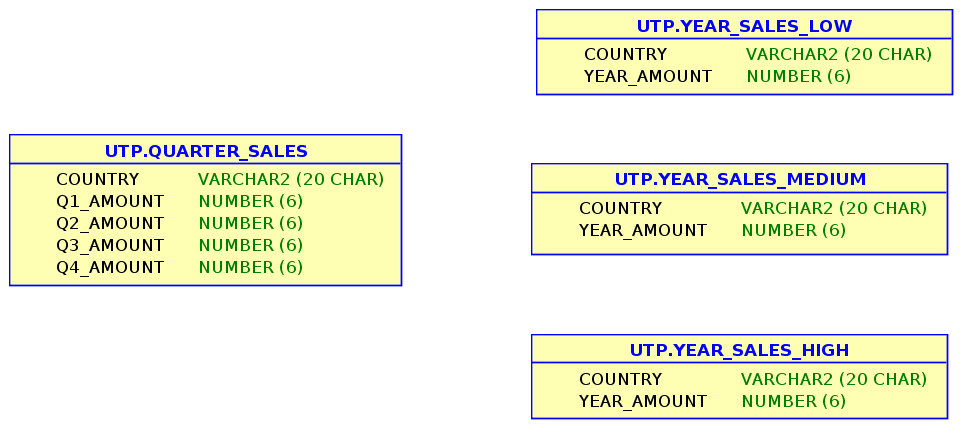

# Quarter Sales

Given the below data model :



Write a program that will move the data from the QUARTER_SALES table to the 3 YEAR_SALES_% tables following these rules :

Year sales are less or equal than 500 : **YEAR_SALES_LOW**  
Year sales are comprised between 501 and 1000 : **YEAR_SALES_MEDIUM**  
Year sales are more than 1000 : **YEAR_SALES_HIGH**

The table QUARTER_SALES stores sales inserted by third party applications. It is loaded anytime and may store several records for any given country.
The 3 YEAR_SALES_% tables present a summary for analysts and is supposed to store one record per country.

### Setup

First create the necessary schema tables using the file  qtr_sales_setup.sql

```
SQL>@qtr_sales_setup.sql
```
